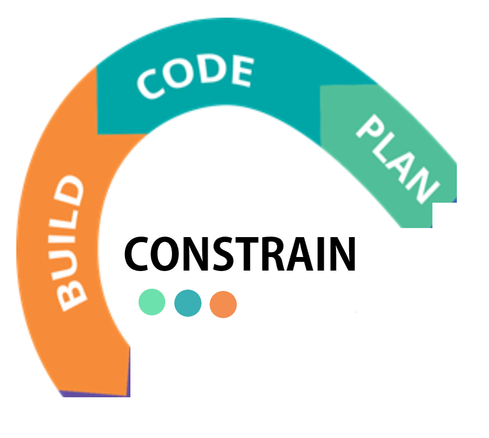

##   Constrain

“constrains” or essential security requirements that act as a design-constrain throughout the development process. 
In SecDevOps  it would mean that in the Plan Phase a security requirement from a standard or best practices is inserted as a design constraint. 
Fullfilling these esential "constrains"ads to the overall security of the product.

