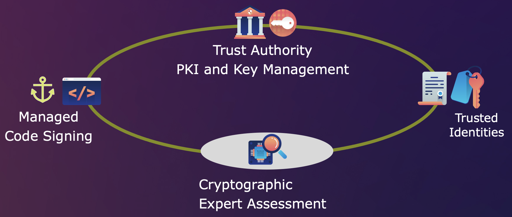
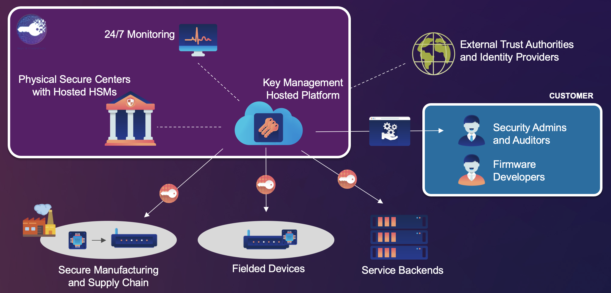

#  SCRATCh - DevOps - Deploy Tools - Keys & Credentials

# Irdeto Keys & Credentials

## Overview
The security of an IoT device is highly dependent on the notion of a trusted unique identity and the associated root security assets, such as symmetric encryption keys, PKI certificates, and passwords. These security sensitive items are typically generated in high-trust environments, often employing hardware security modules (HSMs) for protection.

The resulting keys and credentials have to be provisioned into the IoT devices in a secure manner. This may happen during the semiconductor manufacturing process, in a manufacturing facility where the device is assembled, or online - making use of Zero Trust Provisioning principles - when the device is first connected to a network. 

Irdeto’s Keys & Credentials offering is a fully managed service that provides enhanced security to any IoT device. It ensures recoverability and improves resilience of end-points, and improves the security of the infrastructure and systems in which these end-points reside. Unique keys are provisioned securely into a device to  enable authentication and secure code updates. In addition, Irdeto provides expert cybersecurity assessment services to ensure proper security by design, adherence to security best practices, and secure operations. 

## Service Features & Capabilities
The Keys & Credentials service operated by Irdeto provides the following key features and capabilities:
* **24/7 managed service** for managing the lifecycle of secure material 
* Supports various material types, including **symmetric keys, X.509 certificates, and passwords**
* **Physically isolated environments** for processing and storage of keys
* Trained security professionals
* **99.5%** service availability  
* Backup and disaster recovery
* Keying centers in the **EU** and the **USA** 
* **ISO 27001:2013** certified and **WebTrust** compliant

 

