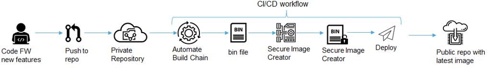
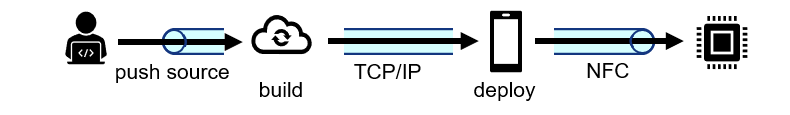
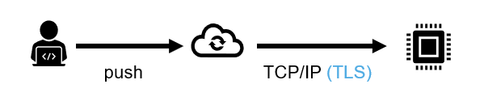

#  SCRATCh - DevOps - Deploy Tools - Remote MCU Firmware update via Git Server & Trust Provisioning Services

# Remote MCU Firmware updates via Git Server

## Automated build & deploy pipeline for embedded targets

*Context:* The created automated cloud based build and deploy pipeline enables a developer to push the source code developed for an embedded target into an online private GitHub repository, from where the pipeline takes over to build an application image from it, secure the application image and finally deploy it to a public GitHub repository from where it can be downloaded for further deployment.

It leverages several tools as listed in the following:
* [NXP MCUXpresso IDE]
* [Docker] used to encapsulate MCUXPresso IDE as target aware compiler in a cloud based runner
* [GitHub Actions] Used for automation of the pipeline on GitHub
* [LPC8N04 Application notes] *TN00040* contains secure image creator tool used for securing the firmware image

## NFC based firmware update for resource constrained IoT devices 

*Context:* Tools used to show an indirect firmware update of a very resource constrained but NFC enabled MCU (ARM Cortex M0+ @8MHz, 32kB program flash memory), without direct cloud access. The update happens via an NFC capable Smartphone as intermediate that receives the secured app binary from the cloud and forwards it to the embedded device via NFC. The validation of security measures then happens on the embedded device.

Used tools:
* NXP firmware update demo consisting of compiled second stage bootloader for the MCU that validates firmware images and the corresponding secure_image_creator desktop tool for securing the image: [LPC8N04 Application notes]
    >*LPC8N04: Encrypted Over the Air (OTA) Firmware update using NFC - Application Note TN00040*.
* [Android Smartphone application] used to foward firwmare image from cloud towards NFC capable MCU
    > *Design Resources > SOFTWARE > Embedded Software > BSP, Drivers and Middleware > Code Snippets > LPC8N04 NFC Demo Android (LPC8N04-NFCDEMO)*
* [NXP MCUXpresso IDE]    

## TLS secured crossover MCU firmware update

The demo shows a [Git based remote firmware update of a crossover MCU]. Such microcontrollers hold as example for a typical processor in IoT or edge devices. As server to provide the updated firmware also this demo just uses an online Git server. In contrast to the previous two sections this IoT device has direct internet access via TCP/IP. The firmware download is secured through a TLS tunnel.

The idea behind is that small to medium enterprises that want to deploy IoT systems may not have the resources to afford or maintain an own IoT cloud infrastructure like AWS or Azure. Leveraging open source services like GitHub for the firmware deployment can enable these companies deploying their own IoT systems.

Used tools / libraries:
* [Mbed TLS]
* [lwIP]
* [NXP MCUXpresso IDE]

# Trust Provisioning Services description

[Trust Provisioning Services] description....

[Git based remote firmware update of a crossover MCU]: https://github.com/SCRATCh-ITEA3/imxrt1060-fwupdate-via-git
[LPC8N04 Application notes]:https://www.nxp.com/products/processors-and-microcontrollers/arm-microcontrollers/general-purpose-mcus/lpc800-cortex-m0-plus-/low-cost-microcontrollers-mcus-based-on-arm-cortex-m0-plus-core:LPC8N04?&tab=Documentation_Tab&linkline=Application-Note
[Android Smartphone application]:https://www.nxp.com/design/designs/lpc8n04-development-board-for-lpc8n04-mcu:OM40002#t755
[Docker]:https://www.docker.com/
[GitHub Actions]:https://github.com/features/actions
[NXP MCUXpresso IDE]:https://mcuxpresso.nxp.com/en/welcome
[lwIP]:https://savannah.nongnu.org/projects/lwip/
[Mbed TLS]:https://tls.mbed.org/