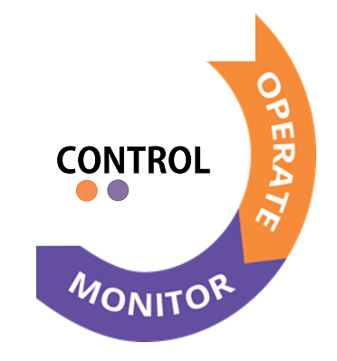

##   Control
After deploy, the system is monitored and operational. in this Phase the system is providing its functionality, e.g. transmitting measurements and usage data e.g. log files and security related events. Operational means the system is activly manintained and/or automatic safe guards protect the system agains most known attacks

