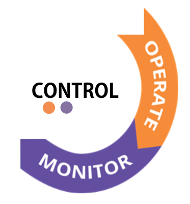

#   SCRATCh -SECURE AND AGILE CONNECTED THINGS- DevOps - Tools 

## About SCRATCh 
Development and operation of secure, large-scale IoT systems is hard. While there exist technological platforms aimed at providing the necessary building blocks to integrate devices and backbone logic, they do not address the major concerns of today’s software-intensive systems: security, agility and a need for continuous deployment.

SCRATCh proposes an integrative approach to IoT, security and DevOps practices through a set of interoperable tools (toolkit) based on a common conceptual architecture and consisting of the following elements

**Security foundation** for strong device identity – use of secure elements protecting secrets providing guarantees on device identity, communication confidentiality, tamper resistance and evidence as well as collecting security metrics as part of the continuous secure deployment chain.

**A SecDevOps-inspired process** consisting of procedures that actively promote continuous deployment of incremental system upgrades that facilitate security and reliability, based on real-world operational metrics.

**DevOps IoT tools** integrating processes and technologies that accelerate development and continuous deployment of IoT solutions. This is based on the DevOps principles and includes security controls, tests and feedback loops, built on top of a secure-by-design architecture.

## About this repository

This repository contains those DevOps IoT tools that have been identified as useful, whether they are commercial or open source tools. The tools have been classified according to the stage of the devops life cycle for which they are likely to be used. You can click on one of the phases below to learn more about the phase and the associated tools. 

<map name="image-map">
    <area target="_self" alt="Constrain" title="/C1_Constrain/" href="/C1_Constrain/" coords="101,199,75,266,16,251,8,59,47,18,149,2,269,19,324,41,336,78,340,98,343,108,274,139,267,181,135,195" shape="poly">
    <area target="_self" alt="Comply" title="Comply" href="./C2_Comply" coords="99,233,241,238,296,175,358,111,408,50,446,21,536,2,639,41,597,85,462,86,402,151,356,206,317,245,291,274,231,316,103,303,59,283" shape="poly">
    <area target="_self" alt="Control" title="Control" href="/C3_Control" coords="655,58,693,145,675,240,595,307,518,315,426,289,398,265,407,226,456,229,445,141" shape="poly">
</map>

