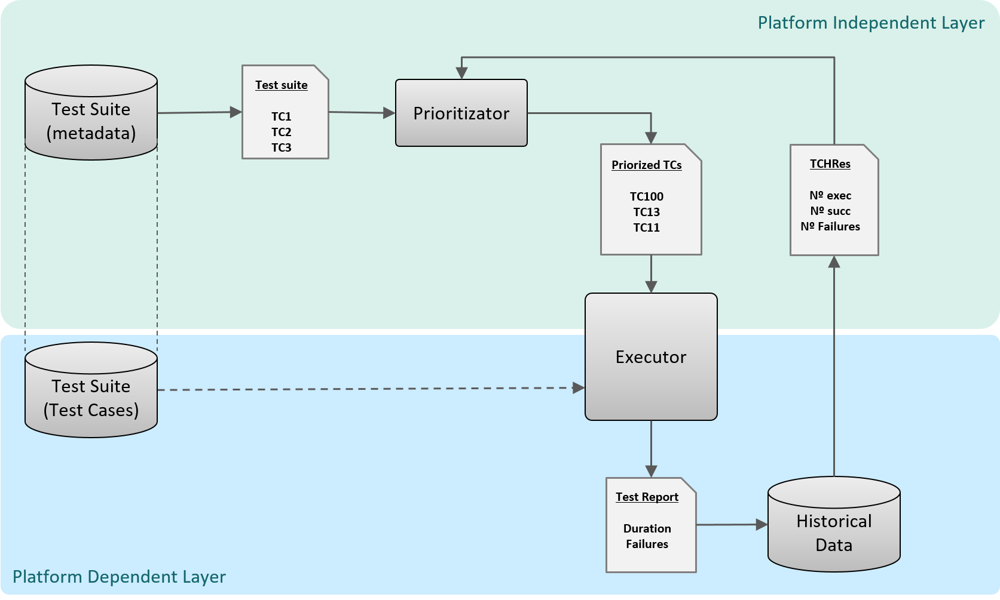

#   SCRATCh - DevOps - Test Tools - Test Prioritization Tool  

## SPTool 
The SPTool is a library that selects and prioritize test cases, to reduce testing time, increase fault detection rate and improve the testing process efficiency while software quality level is maintained. 
The SPtool has been divided into two layers, platform independent layer and platform dependent layer. This division allows to separate test case execution from prioritization, allowing to prioritize test cases independently from the implementation language as well as from the test case management platform.

### SPTool Layers
The SPTool has two layers with the following components in each one:
1. platform independent layer: prioritizer and the test suite metadata 
2. platform dependent layer: implemented test suite, the test case executor  and the historical tests results database 

#### Platform independent layer
In order to abstract the test case prioritization from the final solution, it is necessary to follow a structured data specification that are used to define the prioritization system entry parameters: test suite (metadata), previous test case execution results and changes made to the software code since the last testing. As a result,  the prioritizer will return a prioritized test suite that will be defined with another structured data specification. 

#### Platform dependent layer
The platform-dependent layer, unlike the previous layer, relies completely on the final solution and its purpose. It is therefore necessary to define which is the main objective as well as the tools to be used. Since the main goal is the test case selection and prioritization to optimize testing of embedded systems developed in C/C++. The tool that will be used as the executor's base will be Unity and its ecosystem tools.

## Contact
For more information about the tool, please contact: <alarrucea@ulmaembedded.com>

